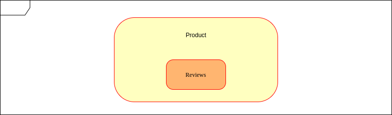

Nos meus poucos anos de experiência em desenvolvimento web, construi algumas APIs REST. Trata-se de uma fácil arquitetura para projetar uma aplicação web. Para entender melhor o que é uma API REST, recomendo a rápida leitura [desse gitbook](https://www.gitbook.com/book/felipemocruha/apis-rest/details), onde publiquei pela primeira vez esse texto.

# Introdução

O REST é um estilo arquitetural que define apenas um conjunto de princípios, propriedades e restrições, portanto existe uma liberdade imensa - no período de desenvolvimento - para projetar os pontos de acesso aos recursos da aplicação sendo construída. Essa liberdade causada pela falta de padrões acaba nos deixando com uma infinita possibilidade de escolhas: como representar meus recursos, coleções e suas relações na URL? Qual método HTTP devo usar para determinada ação? Qual deve ser a resposta do servidor para determinada ação?

Este capítulo propõe boas práticas para se projetar uma API REST de forma que:

* Os pontos de acesso sejam de fácil entendimento para outros desenvolvedores que eventualmente participem do projeto, seja construindo ou dando manutenção para a própria API, seja projetando uma aplicação cliente que conversa com essa API.
* Seus componentes sejam padronizados apenas onde a padronização faça sentido. Boas práticas não são regras pétreas!

#### Representação de recursos e coleções na URL

O capítulo "URLs" já introduz boas práticas para a representação de recursos, então aqui vamos expor quais as consequências de algumas dessas práticas e exemplifica-las através dos recursos e coleções de um projeto de um **e-commerce**.

| HTTP Verb | Localização \(Path\) | Resultado |
| :--- | :--- | :--- |
| GET | /products | Retorna a lista de produtos. |
| GET | /products/3 | Retorna o produto de id 3. |
| POST | /products | Cria um novo produto e o adiciona na lista de produtos. |
| PUT | /products/3 | Substitui o produto de id 3. |
| PATCH | /products/3 | Modifica parcialmente o produto de id 3. |
| DELETE | /products/3 | Deleta o produto de id 3. |

* **A localização dos recursos e coleções deve conter apenas substantivos, jamais verbos.**

Recursos e coleções são abstrações de dados presentes no servidor. As requisições \(GET, METHOD, PUT etc\) feitas a determinado recurso indicam ações que serão aplicadas a ele, portanto é muito mais intuitivo representar os recursos e coleções como substantivos que sofrerão ações das requisições.

* **Os nomes das coleções devem estar no plural. **

Manter os nomes de coleções no plural deixa a utilização da interface API muito mais intuitiva. Fazendo isso, não precisamos lidar com pluralizações estranhas de palavras em inglês. Além disso, as coleções são conjuntos homogêneos e não ordenados de recursos, portanto representá-las como o plural do recurso faz todo o sentido.

#### Lidando com Relações entre Recursos

Caso uma coleção de recursos esteja diretamente relacionada a determinado recurso, como por exemplo uma lista de análises que cada produto tem e que não existe fora dessa relação, podemos representá-la de forma intuitiva aninhando seu nome ao path do ponto de acesso do recurso com que se relaciona.

| HTTP Verb | Localização \(Path\) | Resultado |
| :--- | :--- | :--- |
| GET | /products/3/reviews | Retorna a lista de análises do produto 3. |
| GET | /products/3/reviews/2 | Retorna a análise de id 2 do produto de id 3. |
| POST | /products/3/reviews | Cria uma nova análise e a adiciona na lista de análises do produto 3. |
| PUT | /products/3/reviews/2 | Substitui a análise de id 2 do produto 3. |
| PATCH | /products/3/reviews/2 | Modifica parcialmente a análise de id 2 do produto de id 3. |
| DELETE | /products/3/reviews/2 | Deleta a análise de id 2 do produto 3. |

